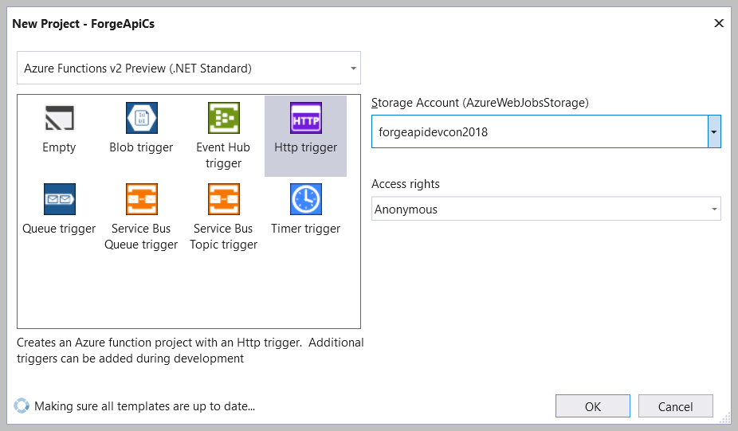
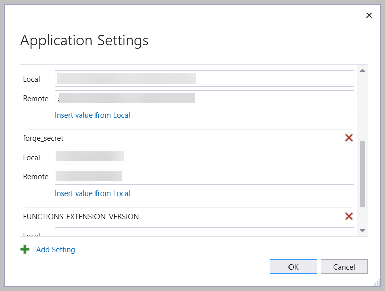

# pwaforgedevcon2018

## HTML STATIC PAGES
All of the html static pages are hosted as pages under https://michaelponti.github.io/pwaforgedevcon2018 (thanks @wallabyway). For those few javascript functions that need some kind of remote server, such as retrieving a viewer token, I am going to use azure functions which will be detailed below.

## AZURE FUNCTION ENDPOINTS
These are serverless function endpoints that are hosted on Azure. If you are an AWS user, the equivalent is Lambda's. In either case you have the option of creating endpoints in .NET core or nodeJS and deploying without ever worrying about a server deployment.

I am using Azure with .NET core for this, but hopefully I will create an equivalent nodeJS function to go along with this.

To setup the project, I used Visual Studio 2017 and used the "Azure Functions" project template. It then gave me the following options to select from:

Check out the code in the AzureFuncs folder.

### Where are the keys?
When you are setting up your publishing profile, you have the option to specify your application settings. In here you can specify ones that get deployed to Azure and local ones.

## PLAYING WITH THE APP
<https://michaelponti.github.io/pwaforgedevcon2018/index.html>
